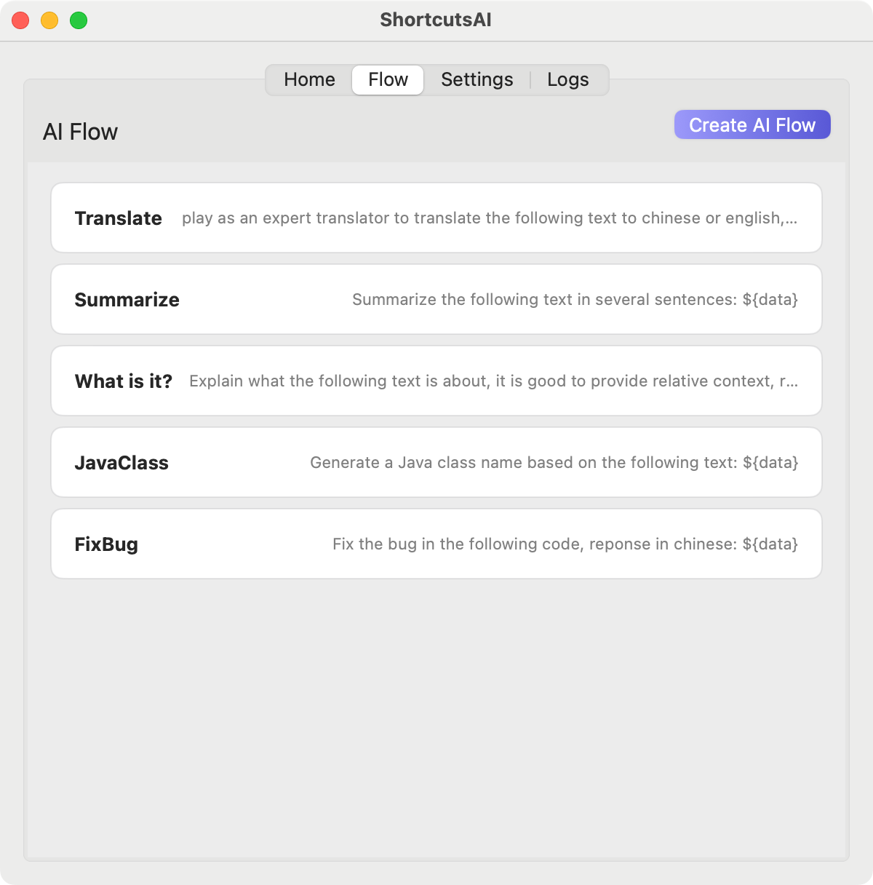

  

  <h1 align="center">
    Shortcuts AI
  </h1>

## Description

**ShortcutsAI** is a macOS app that streamlines the execution of AI-powered shortcuts directly from the menu bar. Key features include:

1. Running AI commands without opening the Shortcuts app or any other AI chat applications.
2. Capturing input information via screenshots **OCR** or directly reading content from your **clipboard**.

These capabilities enable you to quickly and efficiently access and execute custom workflows and automations, significantly enhancing your productivity.

## Snapshots

 
    
    
    

## Sponsor

If you find this project helpful, please consider supporting it with a donation. Your generosity is greatly appreciated! 🙏

 
    
    

